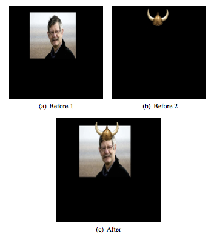
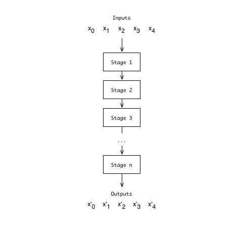
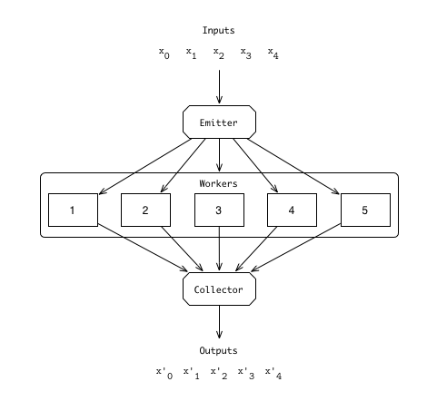
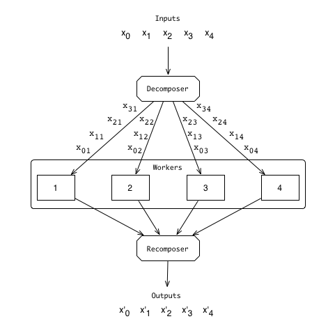
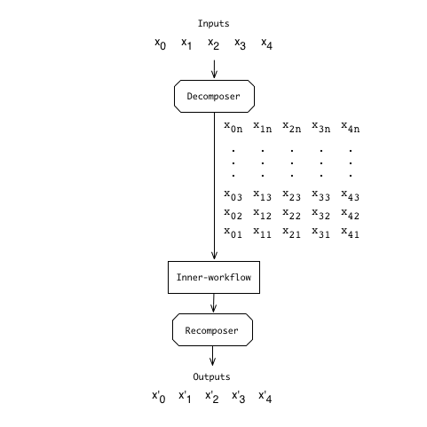
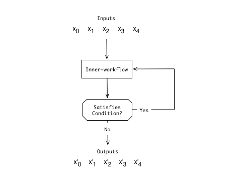

css:./style.css
title: Skel Tutorial

## Tutorial

### Contents

- [Introduction][intro]
    - [What Skel Is][what]
    - [On Parallelism and Skeletons][par_and_skel]
    - [Expectations of this Tutorial][expectations]
- [Getting Started][start]
    - [Compiling the Skel Library][compile]
    - [Calling the Skel Library][invocation]
    - [Skel Workflows][workflows]
- [Workflow Items][wk_itms]
    - [A Recurring Example][example]
    - [The Sequential Function][seq]
    - [The Pipe Skeleton][pipe]
    - [The Farm Skeleton][farm]
    - [The Ord Skeleton][ord]
    - [The Reduce Skeleton][reduce]
    - [The Map Skeleton][map]
    - [The Feedback Skeleton][feedback]
- [Other Notes][notes]
    - [Schedulers][scheduler]
    - [Benchmarking][timings]
    - [Debugging][debug]
- [Further Reading][read]

### Introduction [intro]

#### What Skel Is [what]

Skel is a library produced as part of the [Paraphrase](http://www.paraphrase-ict.eu) project to assist in the introduction of parallelism for [Erlang](http://www.erlang.com) programs. It is a collection of *algorithmic skeletons*, a structured set of common patterns of parallelism, that may be used and customised for a range of different situations. 

#### On Parallelism and Skeletons [par_and_skel]

In recent years, the single-core processor has been usurped by its multi-core cousins, and is unlikely to make a significant return. Whilst it is reasonable to expect a change in development practices to reflect the move to multi-core, any evidence of this happening suggests changes are introduced slowly.

Under single-core architectures, programs were effectively gifted a speed boost with each processor generation. The same cannot be said under multi-core architectures, however. Instead, developers must exploit parallelism if they desire to achieve ever better performance gains.

On paper, *parallelising* programs is straightforward. 

1. Undertake profiling to help determine what should be parallelised and where.
2. The refactoring of code to introduce the generation and management of processes.
3. Debugging and benchmarking.

In practice, however, parallelising programs is difficult. It requires careful thought in coordinating shared resources, avoiding race conditions, and fiddling with synchronisation. Additionally, and in terms of language support, parallelism is often *bolted on*. This likely results in an implementation that is unwieldy at best. Even when the developer has a program that works as intended, we suggest parallelism only *effective* when the changes provide (significant) performance gains. An achievement that is not guaranteed through the manual introduction of parallelism.

Algorithmic skeletons propose to simplify and speed this process by providing commonly-used patterns of parallel computation. With skeletons, the developer need only submit a sequential operation he wishes to perform in parallel. The skeleton itself handling lower-level management, and so many of the headaches that arise during implementation.

The introduction of parallelism then consists of choosing a skeleton, and invoking it with (existing) sequential code. Skeletons may be fine tuned, or replaced altogether, to find the best speedups possible. As such, skeletons are simple to use.

That skeletons themselves handle the low-level aspects of parallelisation, allows their implementation to be thoroughly tested, and based upon proven concepts and ideas. Hence, skeletons are also safe.

It remains that, thus far, the skeletons described above are of an abstract nature. Indeed, skeletons may be adapted to, and implemented in, most languages with support for parallelism. Using Erlang's first-class concurrency primitives, and taking advantage of higher-order functions, skeletons may be thus implemented, presented, and employed as a library. Skel, that which we present here, is such a library.

#### Expectations of this Tutorial [expectations]

From this tutorial, you may expect to gain an understanding of how to invoke Skel, and of the skeletons it offers.

For each skeleton, we include: 

1. a brief summary of what that skeleton is,
2. an explanation of how to use that skeleton within Skel, and
3. one or more examples to help illustrate its use.

As each skeleton featured is summarised, a detailed familiarity of the concept is not necessary. Should more information on skeletons be sought, we include a [Further Reading][read] section.

A reasonable understanding of Erlang and the general concepts behind parallelism are desired, however. Similarly, and whilst we explain the steps needed to invoke Skel and each skeleton, the specific preparation of any existing Erlang program to take advantage of the library is outside the scope of both Skel and this tutorial. 

Lastly, please note that due to the subject nature of this tutorial, there will be a fair amount of Erlang code.

    io:format("It will look something like this").

### Getting Started [start]

#### Compiling Skel [compile]

The Skel library includes a Makefile that may be used to build the library and examples. The most pertinent rules follow.

- `make` compiles the library source and nothing else.
- `make examples` compiles both the library and included examples.
- `make console` compiles the library and returns an interactive console.
- `make clean` cleans the `skel` directory.
- `make tutorial` compiles a copy of the documentation and this tutorial.

#### Invoking Skel [invocation]

Having compiled Skel using one of the above `make` commands sans error, we turn our attention to its basic invocation and use.

If still in the `skel` directory, the `make console` will summon an Erlang shell with access to the library. Elsewhere, the `skel/ebin` directory must be included in the Erlang path. 

We set this either by using the [`-pa`](http://erlang.org/doc/man/erl.html) argument when invoking the Erlang shell, or by adding Skel to the application's dependencies. Either way, and if set correctly, a shell almost identical to that produced by `make console` will allow access to the library.

To test this, we might type the following at the shell prompt:

    skel:do([{seq, fun(X) -> X end}], [1,2,3,4,5]).

This returns `[1,2,3,4,5]` if the Skel library is within your Erlang path, 

    ** exception error: undefined function skel:do/2

otherwise.

Skel may be invoked using one of two functions found in the [`skel`](../../doc/skel.html) module. [`run/2`](../../doc/skel.html#run-2) simply runs a given task in the form of a *workflow* (explained shortly). Note that no result is returned, instead only a pid similar in format to `<0.36.0>`. [`do/2`](../../doc/skel.html#do-2), as seen above, runs a given workflow but also returns the result of that workflow. In the case of our previous example, this was `[1,2,3,4,5]`.

Whilst the latter automatically returns the result of the specified workflow, a result can still be retrieved from the former. This can be done using a `receive` block, expecting the tuple:

    {sink_results, Results}

Where `Results` is a variable, and may be otherwise named.

Input is passed to both [`run/2`](../../doc/skel.html#run-2) and [`do/2`](../../doc/skel.html#do-2) in the form of a list, and is given as the second argument to these functions.

#### Skel Workflows [workflows]

As their name suggests, workflows define how certain actions should be carried out. 

Workflows are constructed as a list of pre-defined tuples representing specific functions and skeletons. We shall refer to these as *workflow items*. Skel currently supports a number of workflow items, the identifier atoms for which are:

- [`seq`][seq],
- [`pipe`][pipe],
- [`farm`][farm],
- [`ord`][ord],
- [`reduce`][reduce],
- [`map`][map],
- [`cluster`][map], and
- [`feedback`][feedback].

These atoms are used as the first element of each workflow item tuple, and identify the item's type. We now introduce each of these; showing how they are used, accompanied by an example.

### Workflow Items [wk_itms]

In this section, we look at the workflow items that may be used in a Skel workflow. Due to the nature of workflows, we note that workflow items can be nested. Indeed, this nesting is necessary for any workflow beyond the most trivial.

We cover the workflow items in a loose order of complexity. Beginning with the simplest, we build upon these -- reusing and expanding our example -- to assist in the explanation of subsequent workflow items. Firstly, however, we must define our recurring example.

#### A Recurring Example [example]

For all skeletons described below, we shall use the running example described herein. The use of which allows us to illustrate how skeletons may be employed in conjunction and comparison with one another.

With the ubiquity of digital images, and 'Photoshop' being entered as a verb into the the Oxford English Dictionary, it is not unfair to suggest the manipulation of images useful. When the size of today's images is also taken into account, the ability to perform these manipulations *quickly* becomes highly desirable.

One example of such a manipulation, and a manipulation amenable to parallelisation, is the Image Merge operation. As its name might imply, and as can be seen in the below figure, Image Merge simply combines two images -- overlaying one atop the other.

Image Merge may be divided into three stages: reading, merging, and writing. For this example, and for reasons of simplicity, we do not consider the writing stage. From the remaining two stages, we thus define the functions `readImage/1` and `convertMerge/1`.

    readImage({FileName, FileName2, Output}) -> 
        {ok, _Img=#erl_image{format=F1, pixmaps=[PM]}} = 
            erl_img:load(FileName),
        #erl_pixmap{pixels=Cols} =PM,
        R = lists:map(fun({_A,B}) -> B end, Cols),

        {ok, _Img2=#erl_image{format=F2, pixmaps=[PM2]}} = 
            erl_img:load(FileName2),
        #erl_pixmap{pixels=Cols2} =PM2,
        R2 = lists:map(fun({_A2,B2}) -> B2 end, Cols2),

        {R, R2, F1, F2, Output}.

    convertMerge({R, R2, F1, F2, Name}) ->
        R1_p = lists:map(fun(L) -> removeAlpha(L, F1) end, R),
        R2_p = lists:map(fun(L2) -> removeAlpha(L2, F2) end, R2),
        WhiteR =  lists:map(fun(Col) -> convertToWhite(Col) end, R1_p),
        Result = lists:zipwith(fun(L1,L2) -> mergeTwo(L1, L2) end, 
            WhiteR, R2_p),
        {Result, length(R), Name}.

The former, `readImage/1`, takes three filenames in a three-element tuple, or triple, and similarly produces a five-element tuple containing two images as binaries, their representation format, and the filename of the output file. As mentioned previously, this output name will not be used in our example as we are ignoring the write phase. Regarding the images themselves, the Erlang library [`erl_img`](https://github.com/mochi/erl_img) is used to load the images, and return their binary representation and image format.

The output of `readImage/1` serves as input for `convertMerge/1`, wherein the composition takes place. The method of merging is simplistic, and mostly for illustration purposes. A triple is returned, containing the resulting image as a binary, the number of columns in that image, and the output name.

These two functions are representative of the first two stages of Image Merge, and perform all operations required of that stage. For our example, these functions are defined in a module titled `conversion`. To perform the Image Merge *sequentially*, we might define a function `sequential/1` in a module named `image`.

    sequential(ImgTuple) ->
        conversion:convertMerge(conversion:readImage(ImgTuple)).

One key motivation for introducing parallelism is that of performance, where *effective* parallelism may introduce significant speedups. To assist in comparing the skeletons included in Skel, we shall therefore consider absolute speedups achieved for each skeleton over Image Merge.

All measurements have been made on an 800Mhz, 24-core, dual AMD Opteron 6176 machine, running Centos Linux 2.6.18-274.e15 and Erlang R16B02. Speedups are calculated by dividing the execution time of the sequential variant by the execution time of the parallel variant in question. All execution times used are the average of ten runs, calculated using Skel's benchmarking function, [`profile:benchmark/3`][timings]. Twenty-five pairs of 1024x1024 images serve as input. 

Having defined our recurring example sequentially, we now look towards its parallelisation. We first consider that which will allow our two functions to work within the context of Skel.

#### `seq` -- The Sequential Function [seq]

The sequential function is the simplest element, and effective base case, in the Skel library.

The `seq` skeleton formats a given function, so that it may receive input within the framework of the Skel library. Inputs are passed as messages to one or more processes that are designed to solely receive these input messages, apply said input to the given function, and send on the result.

Whilst `seq` does not introduce any parallelism beyond that which is inherent in the invocation of Skel, it is nevertheless a necessary bridge between the sequential and parallel variants of a program, or parts thereof. In our example we have two functions, as such we produce two workflow items compatible with Skel. 

The workflow item for the read phase may be constructed thus.

    {seq, fun conversion:readImage/1}

Similarly, for the convert phase we construct:

    {seq, fun conversion:convertMerge/1}

Here, we observe that the passed functions are denoted by the keyword `fun`. In this example, these functions are found in the `conversion` module. Functions declared in the same module as the call to Skel may also be used; in such a case, the name of the module is replaced with the Erlang macro `?MODULE`.

Irrespective of the location of the provided function, and in explanation of how these are used, Skel takes `readImage/1` -- alternatively `convertMerge/1` -- and spawns a process ready to receive input. We call such processes *worker processes*, or more simply, *workers*. When input is received, the worker will apply that input to `readImage/1`. The calculated result, returned by `readImage/1`, is then sent to the process specified by the input, ready for the next stage in the workflow. In the case of a workflow with only one `seq` item, the result of the given function is simply returned to the process that called it.

If we wish to use only the read phase, for example, we might define the function `tutorialSeq/0`.

    tutorialSeq() ->
        skel:do([{seq, fun conversion:readImage/1}], Images).

Here, Skel takes `readImage/1` and the imaginatively named list of image pairs, `Images`. When evaluated, `tutorialSeq/0` will return a list of all five-element tuples that are produced when each tuple in `Images` is applied to `readImage/1`. 

The same may also be done for `convertMerge/1`, with similar results. These two invocations might then be called one after the other, applying the output of the former as input to the latter. Alternatively, one might use both workflow items in the same invocation. We update `tutorialSeq/0` thus:

    tutorialSeq() ->
        skel:do([{seq, fun conversion:readImage/1}, 
                {seq, fun conversion:convertMerge/1}], Images).

In this instance, Skel performs both sequential functions. Image pairs are passed from `Images` to `readImage/1`. The output of which is passed as input to `convertMerge/1`. In turn, the output of this function is returned as the result of `skel:do`.

As no true parallelism is invoked when applying only `seq` workflow items, we might expect to see slowdowns instead of speedups. Indeed, running `tutorialSeq/0` for twenty-five image pairs is twice as slow as the sequential variant. This 'speedup' of 0.47 is likely to be a result of the cost it takes to invoke and use Skel with only two sequential functions. These costs are made profitable in future examples as the skeletons employed save more time than Skel requires.

This example illustrates the simplicity of the sequential function, and indeed, why it might be described as our base case. It is the worker item that does the basic work, as defined by the developer, and system in which Skel is being applied. Whilst little parallelism is used here, future skeletons are dependent upon it. 

As in Image Merge, functions rarely exist alone -- they interact with one another. This means we must somehow chain sequential functions together. 

#### `pipe` - The Pipe Skeleton [pipe]

A pipeline, or pipe, is one of the simplest skeletons. For each stage within the pipeline, that stage's input is the previous stage's output. Parallelism is gained through the application of different inputs at different stages of the pipeline. Indeed, we have already seen an example of a pipe, albeit implicit.

In the final version of `tutorialSeq/1` we used both sequential functions in a single invocation of Skel. We observed that the output of the first was used as input for the second. Implicitly we used a pipeline.

This example may be made explicit by using the `pipe` workflow item. We define `tutorialPipe/0` to illustrate this:

    tutorialPipe() ->
        skel:do([{pipe, [{seq, fun conversion:readImage/1}, 
            {seq, fun conversion:convertMerge/1}]}], Images).

In `tutorialPipe/0`, the two `seq` workflow items are nested within the `pipe` tuple -- composed of the atom `pipe`, and a list of said nested workflow items. By default, a Skel workflow is a pipeline skeleton, and so we shall continue to use pipelines implicitly in future sections.

With `tutorialPipe/0` being equivalent to `tutorialSeq/0` one might expect similar results in terms of performance. Indeed, this is not incorrect -- we receive a speedup of 0.51.

Again, we find this example relatively trivial -- we are only making the implicit explicit. Nevertheless, the pipeline allows for results to be passed between two or more skeletons where nesting those skeletons is either inadvisable or not possible.

#### `farm` -- The Farm Skeleton [farm]

Another simple skeleton, and one more obviously parallel, is the task farm. As illustrated in the above diagram, a farm applies a given function on a number of inputs at the same time. The function is applied using a specified number of workers, is the same for all workers, and in the case of Skel, is defined in terms of a workflow.

In our running example, we have two sequential functions. Whilst `convertMerge/1` is dependent on the output of `readImage/1`, within these functions, inputs are independent. This allows us to perform the same function applied to different inputs at the same time, and so enabling the use of a task farm.

There are two possible ways we might apply a farm to our running example. The first means of application is almost identical to our making the pipeline explicit in the previous section. We might therefore define `tutorialFarmFirst/0` hence.

    tutorialFarmFirst() ->
        skel:do([{farm, [{seq, fun conversion:readImage/1}, 
                    {seq, fun conversion:convertMerge/1}], 10}], Images)).

Here, we use the implicit pipeline workflow from [`tutorialSeq/0`][seq] nested within the `farm` workflow item. The `farm` workflow item consists of its identifier atom, a workflow, and the number of farm workers. In this example we have set the number of workers to ten, but this may be set to howsoever many workers desired. For example, we note it possible, albeit trivial, to produce a farm with a single worker -- thus effectively replicating `tutorialPipe/0`. 

An alternative is thus defined:

    tutorialFarmSecond() ->
        skel:do([{farm, [{seq, fun conversion:readImage/1}], 10}, 
                    {farm, [{seq, fun conversion:convertMerge/1}], 10}], Images).

Under `tutorialFarmSecond/0` we have adjusted the relationship between the pipeline and farm skeletons. Now we observe that the two phases of Image Merge are themselves evaluated using two separate farms, with the output of the first piped as input to the second. The work performed by both `tutorialFarmFirst/0` and `tutorialFarmSecond/0` is equivalent, and produces similarly equivalent results.

The same cannot be said of performance however. For `tutorialFarmFirst/0` and `tutorialFarmSecond/0`, our running example receives speedups of 11.59 and 9.1 respectively. But before we tackle this discrepancy, we note this a great improvement compared with both `tutorialSeq/0` and `tutorialPipe/0`. Here, we observe the workers saving sufficient time to not only cover the cost of invoking the library, but to improve upon the basic sequential Image Merge. 

In comparing the two task farm approaches, we remark that speedups may vary. That the degree to which performance is improved depends upon how the skeletons are used and arranged. These decisions are up to the developer, and the program on which he is working -- hence, it remains beneficial to consider alternative variations when using skeletons to introduce parallelism. Luckily, and by virtue of using skeletons, this is simple to do. We do again note, however, that either variant is a very good improvement over the sequential Image Merge.

Similar to the difference between speedups, and whilst both `tutorialFarmFirst/0` and `tutorialFarmSecond/0` produce the same results for a given list of image pairs, these results need not necessarily be in the same order to either each other or the sequential variant. Indeed, the farm skeleton does not preserve ordering. 

#### `ord` -- The Ord Skeleton [ord]

The *ord* skeleton is a wrapper that ensures output from its inner-workflow has the same ordering as the input ord receives. This is useful where other skeletons do not inherently preserve ordering, but where ordering is nevertheless desired.

Similar to [pipe][pipe] and the [sequential function][seq], it is a two-element tuple consisting of its identifier atom, `ord`, and a worfklow. We note that ord does not affect the evaluation of the nested workflow in any way beyond the ordering of its results.

To illustrate this, let us apply ord to our running example. We observed that the list of merged images produced by [`tutorialFarmFirst/0`][farm], or indeed [`tutorialFarmSecond/0`][farm], was not in the same order as its input list of image pairs, hence we wrap this task farm in an ord workflow item.

    tutorialOrd() ->
        skel:do([{ord, [{farm, [{seq, fun conversion:readImage/1}, 
                    {seq, fun conversion:convertMerge/1}], 10}]}], Images).

When evaluated, `tutorialOrd/0` produces a list of images in the same order as the image pairs that produced them.

In terms of performance, `tutorialOrd/0` produces a speedup of 9.43. This is expectedly similar to the speedups gained when using a task farm -- it is particularly similar to the speedup gained from `tutorialFarmSecond/0`. Yet, it remains that `tutorialOrd/0` uses `tutorialFarmFirst/0` for its inner-workflow. 

A speedup of 9.43 is reasonably less than that of 11.59. This, we observe, serves to highlight why task farms and other skeletons do not inherently preserve order. That, because the preservation of order is not always necessary, the possibly significant performance cost it entails does not always need to be paid. The ord skeleton enables the preservation of order only where it is required or desired, and thus the performance cost for this ordering need only be paid where it is applied.

Regardless of their ordering, lists feature heavily in Erlang. Operations on these lists are also a common occurrence. It would be odd, then, for Skel to lack a skeleton whose focus they are.

#### `reduce` -- The Reduce Skeleton [reduce]

The `fold` higher-order function takes a function, a list, and a starting point, and recursively combines all elements in the list using the given function and starting point. Informally, it can be said to replace the `cons` function comprising said list with the developer-given function. The reduce skeleton is a parallelisation of `fold` -- i.e. where individual applications of the given function are run in parallel until only one element remains.

To give an adequate demonstration of this skeleton and its use in Skel, we must first modify our running example. At present, Image Merge takes a list of tuples, which are, in turn, composed of three strings. These tuples are read via the function `readImage/1`, and then converted by `convertMerge/1`. To make best use of the reduce skeleton, we shall modify our running example to Batch Image Merge, in which an entire list of images are merged.

Under Batch Image Merge we expect as input a two-dimensional list, with the inner lists containing the filename strings of those images to be merged. To process these, we shall again use a pipeline of two stages: the first being a task farm to read the images, and the second to merge these images using reduce.

To accommodate the new input specification, we modify `readImage/1` thus.

    readImage([]) -> [];
    readImage(FileNames) ->
        FileName = hd(FileNames),
        {ok, _Img=#erl_image{format=F1, pixmaps=[PM]}} = 
            erl_img:load(FileName),
        #erl_pixmap{pixels=Cols} =PM,
        R = lists:map(fun({_A,B}) -> B end, Cols),
        R_p = lists:map(fun(L) -> removeAlpha(L, F1) end, R),

        [R_p] ++ readImage(tl(FileNames)).

As the input list of filenames is of variable length, unlike the tuples in our previous definition of `readImage/1`, we use recursion to produce the desired list of image binaries. Beyond the means to facilitate recursion, and the reading of a sole image into memory, the only other change incurred is that that the alpha channel is now removed during the read phase. This is done to simplify the input specification of `convertMerge/1`.

Similarly, we modify `convertMerge/1` hence:

    convertMerge(R, R2) ->
        WhiteR =  lists:map(fun(Col) -> convertToWhite(Col) end, R),
        Result = lists:zipwith(fun(L1,L2) -> mergeTwo(L1, L2) end, 
                    WhiteR, R2),
        Result.

Now notably smaller, `convertMerge/2` receives as input two image binaries used for the image to be produced. The function performs only the latter two tasks of the original definition. Indeed, `convertMerge/1` also only returns the resulting binary image, in place of the triple of its previous incarnation. This facilitates the use of the output of a middling phase in the reduce operation as input for the next.

We now define the function `tutorialRed/0` to invoke Skel and the reduce skeleton.

    tutorialRed() ->
        skel:do([{farm, [{seq, fun conversion:readImage/1}], 10}, 
                    {reduce, fun conversion:convertMerge/2, fun util:id/1}], 
                                                              ReduceImages).

As one might expect, `ReduceImages` is our two-dimensional list of input images. We further observe, and as mentioned previously, that the images are loaded into memory using a task farm with ten workers. The output of which -- similarly a two-dimensional list of image binaries -- is piped as input to our reduce workflow item.

The reduce workflow item is a triple composed of its identifier atom, a  reduction function, and a decomposition function. The reduction function is used to combine, or *reduce*, two elements of the input list to a single element. Where the decomposition function, may be used to define how individual inputs may be decomposed and so reduced.

For Batch Image Merge, `convertMerge/2` serves as our reduction function as it takes two images, returning one. As for decomposition, and for simplicity and clarity, the identity function is used. Our identity function, `id/1`, simply returns its input unchanged.

That Batch Image Merge is a slightly different example to our primary, running example, makes it illogical to simply give and compare speedups between them for arbitrarily long lists of images. Yet, were we to restrict the batches of images to lists of length two, we mimic the tuples of our running example. Hence, when we quote a speedup of 9.91 for the reduce skeleton, this suggests it gained through the evaluation of twenty-five batches of two images.

We might point to that of the speedups gained through the use of the Ord skeleton, 9.43, and through [`tutorialFarmSecond/0`][farm], 9.1, and consider it a good speedup. As `tutorialRed/0` is based upon the latter, even more so. We suggest, however, that for the example used here the application of the reduce skeleton is not overly desirable. We instead suggest its application desirable as an alternative to `fold`. 

Returning to our example, another point introduced in the change to Batch Image Merge is that we omit the means to define an output name for the similarly omitted writing phase. We suggest our modified example further modifiable to allow the inclusion of both said writing phase and output name.

Keeping Batch Image Merge in mind, we consider the task farm once more. The farm skeleton works well when inputs are relatively small; but what of when this is not the case, when the inputs themselves might be better broken down and so worked on in their partite form.

#### `map` and `cluster` -- The Map Skeleton [map] 

As with reduce in the [previous section][reduce], the map skeleton serves to parallelise the higher-order function with which it shares a name. The sequential map takes two arguments -- a list and a function. This function is applied to each element in that list. In Skel, and for each list passed as input, the map skeleton applies its inner-workflow to each element in each input in parallel. 

To achieve this parallelism, Skel again uses worker processes to which each element is sent and worked on. Unlike the task farm, map is able to automatically determine how many workers it requires. The total number of workers needed is determined by the length of its inputs. Should one input be longer than its forerunners, more workers are simply added so that the total number of workers is equal to the current input's length.

Whilst the number of generated processes is not normally problematic due to the Erlang scheduler, it is also possible to specify the number of workers available to map. This might be desirable for when fine tuning performance, for example. 

When invoking the map skeleton, either a two- or three-element tuple is used. The first two elements of either tuple consist of the identifier atom, `map`, and an inner-workflow. The third element in the three-element tuple sets the number of workers used.

The map skeleton is applied to lists, rendering it unsuitable to be used directly with our running example. The reduce skeleton in the [previous section][reduce] also used lists as input, and so we shall recycle our adjusted example here.

In [`tutorialRed/0`][reduce], the task farm pertaining to the first phase of the operation takes a list of filenames as input, producing a list of the associated binary images. The function `readImage/1` is mapped to each element in each input list. Ergo, we define `tutorialMap/0` to use a map skeleton in lieu of the task farm in `tutorialRed/0`.

    tutorialMap() ->
        skel:do([{seq, fun util:makeLst/1}, 
                    {map, [{seq, fun conversion:readImage/1}], 10}, 
                    {reduce, fun conversion:convertMerge/2, fun util:id/1}], 
                                                            ReduceImages).

In `tutorialMap/0`, we observe two things. The first is the setting of the number of workers available to the map; this may, of course, be removed. The second, and arguably, more immediate point of interest is that of the extra sequential function. 

As we change nothing beyond the introduction of the map skeleton, `ReduceImages` naturally remains the same. Yet, the input format required between the task farm and `readImage/1` is not the same as that between map and `readImage/1`. To bridge this disparity we include an additional sequential function to our pipeline that makes a single element list of each input. An alternative would be to again change `readImage/1`, `ReduceImages`, or both; an exercise that is left to the reader.

Whilst a valid use of the map skeleton, a better example as to its employ might be during the second phase. In the merging of image pairs, and depending on image size, large amounts of binary data must be manipulated. This binary data might therefore be decomposed and each part worked on separately. To this end, we choose to employ the cluster skeleton.

During map, inputs are decomposed, sent to a worker process, and then those partite elements recomposed ready to be forwarded onwards. Under a standard map, where the input is a list, this decomposition is equivalent to the identity function -- i.e. the list passes through unchanged. Similarly,  recomposition is merely the creation of a list to which each decomposed element is appended.

This process of decomposition and recomposition is made more generic in the cluster skeleton. The developer may define functions for both stages, this also happens to allow the manipulation of inputs amenable to map in a wider variety of formats. During execution, and having decomposed each input, cluster sends all decomposed elements to a single worker process at which a given inner-workflow will be applied to the aforementioned elements.

To accommodate these, the cluster workflow item is a four-element tuple. It is composed of the identifier atom `cluster`, an inner-workflow, a decomposition function, and a recomposition function in that order. To demonstrate an application of the cluster skeleton, we now consider how it may be applied to the second phase in the standard version of our recurring example. 

The input for the second phase is a five-element tuple containing two images. These images are in the form of a list of binaries, and so may be decomposed, with each pair of elements merged separately. We thus define our imaginatively named decomposition function.

    decomp({[], _, _, _, _}) -> 
        [];
    decomp({_, [], _, _, _}) ->
        [];
    decomp({R1, R2, F1, F2, Name}) ->
        [{[hd(R1)], [hd(R2)], F1, F2, Name}] ++ 
                            decomp({tl(R1), tl(R2), F1, F2, Name}).

From this definition, we do highlight the caveat that both images should be of the same size. Regardless, we are now able to decompose our image pairs -- this is not altogether useful, however, unless we are able to recompose them. We define the similarly simple function `recomp/1` to do this.

    recomp(Parts) -> 
        Img = lists:map(fun({[A], _B, _C}) -> A end, Parts),
        {_, _, Name} = hd(Parts),
        {Img, length(Img), Name}.

Within this definition, we need not be concerned about different parts from different inputs being mixed together. The map skeleton automatically tracks the group to which a part belongs, as well as the order of the parts derived from each input.

With our decomposition and recomposition functions defined, we have all components necessary to invoke Skel. For this we define the function `tutorialCluster/0`.

    tutorialCluster() ->
        skel:do([{farm, [{seq, fun conversion:readImage/1}], 10}, 
                  {cluster, [{farm, [{seq, fun conversion:convertMerge/1}], 10}], 
                  fun util:decomp/1, fun util:recomp/1}], Images).

As in the standard map, we are inspired by [`tutorialFarmSecond/0`][farm]. `tutorialCluster/0` uses a task farm for the first phase, with the newly-defined `cluster` used in place of the second. We observe that a task farm is used as the inner-workflow to cluster. This is included so as to evaluate each decomposed element in parallel.

For large images, it would seem the cluster skeleton quite suitable for Image Merge, with a speedup of 10.07 appearing to support this. Indeed, the use of cluster proves faster than `tutorialFarmSecond/0` which inspired it. It is likely that further adjustments, such as the use of more workers in the nested task farm, could improve these speedups further still.

As with the speedup given in the [previous section][reduce], those gained for `tutorialMap/0` were the fruit of twenty-five lists of two-elements in length. Here we see the return of slowdowns, 0.4 in magnitude. We note this likely due to the sequential function introduced to the start of the pipeline. We further suggest that whilst this cost may be eliminated with further edits to the running example and the example used for reduce, the use of cluster remains more desirable for our running example due to its relatively simple application and good speedups.

We suggest that, under this example, and between the two skeletons, the use of cluster is preferable to map. With the unadulterated recurring example, the merging of the image pairs is more computationally intensive than that of the loading of said images and so has the greatest opportunity for parallelism to be effective. Aside from implementation choices, we observe that under cluster the exemplar program needed little change to include the skeleton. Conversely, comparatively much greater change would be required for a truly suitable application of map.

The `map` and `cluster` workflow items are similar in their execution, the difference being the latter is a wrapper skeleton. We have seen another wrapper skeleton in [`ord`][ord], and our final section and skeleton may also be thus considered.

#### `feedback` -- The Feedback Skeleton [feedback]

The feedback skeleton repeatedly applies each input to a given function until a set condition fails. Whilst the condition holds, the tested output is passed back into the skeleton as input. The overall returned result of the skeleton is a list of all transformed inputs in the form that failed the condition.

Akin to [`ord`][ord] and [`cluster`][map], the feedback skeleton might be considered a wrapper as it may contain any other skeleton. In Skel, we see this in the form of a nested workflow -- itself a pipeline.

One example of this is the application of feedback to a task farm. Recall that in a farm independent inputs are passed to a number of workers that apply a given function. The feedback skeleton adds an extra stage in which these returned results are then checked against the similarly given constraint-checking function, and either returned as input or output accordingly.

The feedback workflow item is a triple that takes the identifying atom, `feedback`; a workflow; and a developer-defined function. As in both the [`ord`][ord] and [`cluster`][map] workflow items, the second element determines the workflow items that feedback modifies. The third element is the constraint-checking function used to check the given condition or conditions; it should return a boolean value.

We might choose to apply the feedback skeleton to our running example. Firstly, we define the constraint-checking function `constraint/1` to always return false. We thus define `tutorialFeedback/0`.

    tutorialFeedback() ->
        skel:do([{farm, [{seq, fun conversion:readImage/1}], 10}, 
                    {feedback, [{farm, [{seq, 
                            fun conversion:convertMerge/1}], 10}], 
                            fun util:constraint/1}], Images).

Using [`tutorialFarmSecond/0`][farm] as a base yet again, this function applies the feedback skeleton to the second task farm in the pipeline. Indeed, this example is effectively equivalent in terms of functionality to [`tutorialFarmSecond/0`][farm]. It arrives at the same result, barring perhaps ordering, due to each input only being passed through the task farm, and so `convertMerge/1`, once. Here we observe that the feedback skeleton always evaluates its workflow at least once.

With `tutorialFeedback/0` we see speedups of 9.19 over our list of twenty-five image pairs. This is again similar to [`tutorialFarmSecond/0`][farm]. This result, as with the example itself, is relatively uninteresting beyond the suggestion that the feedback skeleton has less of an impact than [`ord`][ord]. 

Of course, it is eminently possible to apply the feedback skeleton to both stages in the pipeline, or to the sole task farm in [`tutorialFarmFirst/0`][farm]. Under the current definition of the constraint function it does not matter how the feedback skeleton is applied. As a consequence of this, such an example is relatively unsatisfying. Let us instead briefly consider the humble ant.

Ant Colony Optimisation is a heuristic for solving difficult optimisation problems inspired by, rather unsurprisingly, the behaviour of ants and their colonies. Such algorithms involve a number of ants each independently solving a given problem. The ants are loosely guided by a pheromone trail laid by their predecessors. Following the ants' completion, this pheromone trail is updated using the best, newly-found solution. The ants then begin again; repeating this cycle until certain point is reached.

This repetition, this *feedback* of the pheromone trail, makes Ant Colony Optimisation problems amenable to the feedback skeleton. For the constraint function, one might desire a certain quantity to be below a certain threshold. Alternatively, it could simply be a cap on the number of iterations performed. Where for the workflow, a map or farm skeleton might be used for ants to run their tasks in parallel. 

### Other Notes [notes]

#### Schedulers [scheduler]

Being a library designed to assist in the parallisation of programs, it is worth remarking on Erlang processes. Normally, the Erlang virtual machine will start with access to all available cores and those cores will be used according to Erlang's scheduler. 

When performing tasks that are highly parallel, such as our recurring example and in conjunction with the Skel library, all cores will be used at near maximum capacity. It is, however, possible to restrict the number of cores available to Erlang's scheduler.

To take an example,

    erlang:system_flag(schedulers_online, 4).

will restrict the number of cores available to use to four. It is likely also worth noting that this number cannot be set higher than the maximum available number of cores on the base machine.

This is commonly set in the function that calls Skel. For example, to restrict the above [`tutorialFarmFirst/0`][farm] example to use a variable number of cores one might modify the function hence.

    tutorialFarmFirst(X) ->
        erlang:system_flag(schedulers_online, X),
        skel:do([{farm, [{pipe, [{seq, fun conversion:readImage/1}, 
            {seq, fun conversion:convertMerge/1}]}], 10}], Images)).

#### Benchmarking [timings]

Primarily designed for testing, the [`sk_profile`](../../doc/sk_profile.html) module included in Skel allows for relatively easy benchmarking of functions. [`benchmark/3`](../../doc/sk_profile.html#benchmark-3) takes a function to execute, the arguments to be passed to said function, and the number of times that function should be evaluated. It then produces a list of tuples giving a variety of averages based on the time taken to evaluate the given function the specified number of times.

Using [`benchmark/3`](../../doc/sk_profile.html#benchmark-3) is similar in method to using the [ord][ord] skeleton. Indeed, to illustrate this, the below defines an exemplar function to its use.

    tutorialTimeOrd() ->
        sk_profile:benchmark(fun ?MODULE:tutorialOrd/0, [], 10).

The function `tutorialTimeOrd/0` is defined in the same module as the majority of examples used throughout this tutorial and evaluates `tutorialTimeOrd/0` a total of ten times. The empty list is used here as `tutorialTimeOrd/0` takes no arguments.

This function returns a list of tuples containing a number of timings in microseconds, listed below.

1. The number of times the function was evaluated.
2. The time taken by the quickest evaluation of `tutorialOrd/0`.
3. The time taken by the slowest evaluation.
4. The median of all times recorded for all evaluations.
5. The mean average of all times recorded.
6. The standard deviation for all times recorded.

#### Debugging [debug]

Finding errors in sequential code can often be a difficult task; regretfully parallel programs are no different. 

Whilst Skel is designed to avoid the common errors associated with parallelism, should any problem occur, the `sk_tracer` module provides a means of seeing a visualisation of the messages sent between processes. 

More generally, the tracer allows one to view the passing of information in a visual manner. Indeed, this may assist in understanding how a particular operation or skeleton works under a given set of circumstances. The tracer viewer may be displayed using the following command in the Erlang console.

    sk_tracer:start().

The visualiser is then displayed, and populated with the messages sent by the next call to Skel.

### Further Reading [read]

The below is a list of papers related to Skel and the ideas behind it.

Algorithmic Skeletons: Structured Management of Parallel Computation
:   Murray Cole
:   MIT Press (1991)
:   ISBN: 0-262-53086-4
:   URL: [Link](http://homepages.inf.ed.ac.uk/mic/Pubs/skeletonbook.ps.gz)

Bringing skeletons out of the closet: a pragmatic manifesto for skeletal parallel programming
:   Murray Cole
:   Parallel Computing 30 (2004) pp. 389--406
:   Elsevier Science Publishers B. V., Amsterdam
:   DOI: 10.1016/j.parco.2003.12.002
:   URL: [Link](http://dx.doi.org/10.1016/j.parco.2003.12.002)

A Survey of Algorithmic Skeleton Frameworks: High-level Structured Parallel Programming Enablers
:   Horatio González-Vélez, Mario Leyton
:   Software—Practice & Experience - Focus on Selected PhD Literature Reviews in the Practical Aspects of Software Technology, 40 (2010), pp. 1135--1160
:   John Wiley & Sons, Inc.
:   DOI: 10.1002/spe.v40:12
:   URL: [Link](http://www.comp.rgu.ac.uk/staff/hg/publications/skeletal-reviewR3.pdf)

Paraphrasing: Generating Parallel Programs using Refactoring
:   Christopher Brown, Kevin Hammond, Marco Danelutto, Peter Kilpatrick, Holger Schöner, Tino Breddin
:   Formal Methods for Components and Objects 7542 (2013), pp. 237--256
:   Springer Berlin Heidelberg
:   DOI: 10.1007/978-3-642-35887-6_13
:   URL: [Link](http://www.paraphrase-ict.eu/paperList/fmco-refactoring/)

Cost-Directed Refactoring for Parallel Erlang Programs
:   Christopher Brown, Marco Danelutto, Kevin Hammond, Peter Kilpatrick, Archibald Elliott
:   International Journal of Parallel Programming
:   Springer US
:   DOI: 10.1007/s10766-013-0266-5
:   URL: [Link](http://dx.doi.org/10.1007/s10766-013-0266-5)
